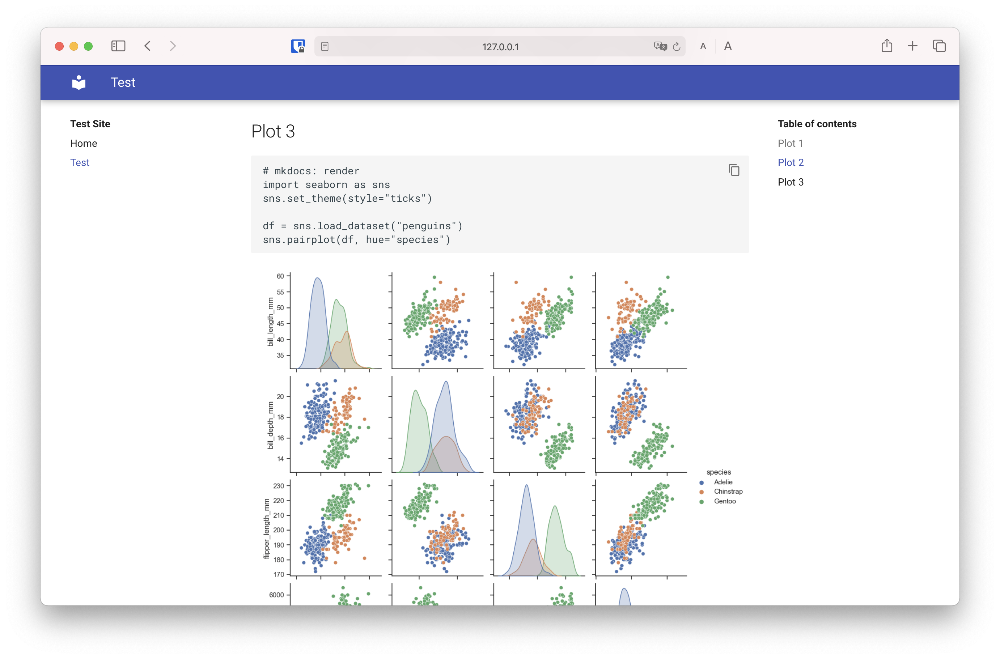

# Mkdocs-Matplotlib

[](https://badge.fury.io/py/mkdocs-matplotlib)
[](https://github.com/AnHo4ng/mkdocs-matplotlib/actions/workflows/test.yml)
[](https://github.com/AnHo4ng/mkdocs-matplotlib/actions/workflows/release.yml)
[](https://github.com/AnHo4ng/mkdocs-matplotlib/actions/workflows/conde_quality.yml)
[](https://mkdocs-matplotlib.readthedocs.io/en/latest/?badge=latest)
[](https://pypi.org/project/kedro/)
[](https://github.com/AnHo4ng/mkdocs-matplotlib/blob/master/LICENCE)


**Mkdocs-Matplotlib** is a plugin for [mkdocs](https://www.mkdocs.org/) which allows you to automatically generate matplotlib figures and add them to your documentation.
Simply write the code as markdown into your documention.



## Quick Start

This plugin can be installed with `pip`

```shell
pip install mkdocs-matplotlib
```
To enable this plugin for mkdocs you need to add the following lines to your `mkdocs.yml`.

```yaml
plugins:
  - mkdocs_matplotlib
```

To render a code cell using matplotlib you simply have to add the comment `# mkdocs: render` at the top of the cell.

```python
# mkdocs: render
import matplotlib.pyplot as plt
import numpy as np

xpoints = np.array([1, 8])
ypoints = np.array([3, 10])

plt.plot(xpoints, ypoints)
```
